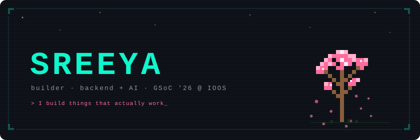

<div align="center">



<br/>


<br/>


</div>

---

## `> whoami`

Third-year CSE student. I like building **real systems that solve real problems** — backend-heavy, AI where it adds value, and always meaningful.

- Currently leveling up in System Design + scalable architectures + DSA (green coding) 
- I gravitate toward **ML pipelines, API design, and systems** that need to actually work under pressure  
- Most of my projects orbit **sustainability + safety** — oceans, waste, clinical AI, home security
- **GSoC '26 Contributor** at IOOS — shipping code in the open, collaborating globally    

---

## `> ls projects/`

### `drwxr-xr-x  ML + AI`

| Project | What it does | Stack |
|---|---|---|
| **[AquaScan — Marine Debris Detection](https://github.com/staree14/marine-debris-detector)** | Automated underwater debris + anomaly detection from side-scan sonar imagery. Object detection and segmentation on real sonar data. **SIH — Top 10 / 135 teams.** | YOLOv8, Python, OpenCV |
| **[ClawSentinel — Smart Home AI](https://github.com/staree14/claw-sentinel)** | Context-aware home security intelligence layer — Isolation Forest anomaly detection + multi-agent reasoning via OpenClaw. Knows your cat from a criminal. **Samsung PRISM.** | FastAPI, Scikit-learn, React, Three.js, OpenClaw |
| **[ClinicalTriage-RL](https://github.com/staree14/clinical-triage-env)** | POMDP-based ER triage env where an LLM agent must discover hidden symptoms before diagnosing. GRPO-trained to beat expert baselines — 82% less test spam, 340% more discovery. **Meta × Scaler OpenEnv Hackathon.** | Python, GRPO, RL, Docker, HuggingFace |
| **[CodeSentinel — AI Code Security](https://github.com/staree14/code-sentinel)** | AWS-native platform that scans codebases for vulnerabilities using LLM-powered analysis. Built in 24 hours. **AWS AI/GenAI Hackathon.** | AWS Bedrock, Lambda, Python, React |
| **[Mangrove Change Detection](LINK)** | Multi-year satellite land cover classification for Pichavaram mangroves. RF + ConvLSTM pipeline on Landsat time series to detect ecosystem loss/gain. | Python, Scikit-learn, TensorFlow, GIS, CNN |
| **[Sky Swachh](https://github.com/staree14/sky-swachh)** | Satellite + space tech for solid waste detection and monitoring. **2nd place — Space Tech Hackathon (top 20 / 170+ teams).** | Python, Computer Vision, GIS |

### `drwxr-xr-x  Systems + Backend`

| Project | What it does | Stack |
|---|---|---|
| **[SARATHI — Smart Convoy AI](LINK)** | Multi-convoy route optimization for military logistics. OSRM routing + OR-Tools solver. **CODE RED 3.0 — Top 15 / 1000+ teams.** | FastAPI, OR-Tools, OSRM, Python |
| **Campus HelpDesk** | NLP-powered chatbot for student queries — syllabus, timetable, faculty lookup via retrieval pipeline. | Python, NLP, FastAPI |

### `drwxr-xr-x  Web + Full Stack`

| Project | What it does | Stack |
|---|---|---|
| **[Quest — Goal Tracker](LINK)** | Full-stack goal tracking with auth, CRUD, and Chart.js progress viz. | Flask, JavaScript, HTML/CSS |
| **[Sanity Saviour](LINK)** | Responsive mental health awareness web app. | HTML, CSS, JavaScript |

---

## `> cat gsoc.md`

### 🌊 GSoC 2026 — IOOS / noaa_coops

[> Link to Report ](https://medium.com/@sreeyachand/google-summer-of-code-2026-final-work-report-ioos-a203eb4c8b76)

Contributing to the `noaa_coops` Python package for NOAA CO-OPS ocean data APIs. Modernizing the library's API surface, improving test coverage, and shipping new data access methods for the oceanographic research community.

---

## `> cat tech_stack.txt`

### 💻 Languages
<p>
  
</p>

### ⚙️ Backend & Systems
<p>
  
</p>

### 🌐 Web
<p>
  
</p>

### 🗄 Databases
<p>
  
</p>

### 🤖 AI / ML
<p>
  
</p>

---

## 📊 GitHub Activity

<p align="center">
  
  <br/>
  
</p>

---

## `> echo $MINDSET`

```
> Build fast. Learn deeply. Stay consistent.
> No shortcuts — just compounding effort.
> I would rather try and fail than do nothing at all.
```

<p align="center">
  
</p>

---

## `> contact --reach-me`

<p align="center">
  <a href="mailto:sreeya.kr20@gmail.com">
    
  </a>
  &nbsp;&nbsp;
  <a href="https://www.linkedin.com/in/sreeya-chand">
    
  </a>
  &nbsp;&nbsp;
  <a href="https://github.com/staree14">
    
  </a>
</p>

---

<div align="center">

```
╔═══════════════════════════════════════════════╗
║  Built with caffeine and compounding effort.  ║
║  Thanks for stopping by! ⭐                   ║
╚═══════════════════════════════════════════════╝
```

</div>
